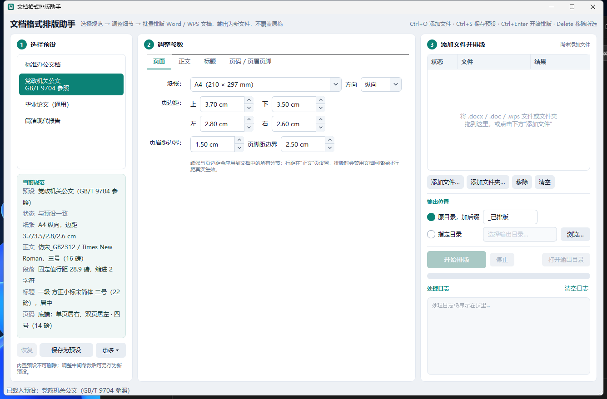

# 文档格式排版助手（Word / WPS 一键排版）

一个 Windows 桌面小工具：把预设好的排版规范（字体、字号、行距、页边距、页码、页眉页脚等）一键套用到 Word / WPS 文档（`.docx`），支持批量处理与自定义预设。

基于开源库 [python-docx](https://github.com/python-openxml/python-docx) 与 [PySide6](https://doc.qt.io/qtforpython/) 编写；界面样式为自定义 QSS。

## 界面截图

主界面 —— ① 选择预设 → ② 调整参数 → ③ 添加文件并排版 三栏工作流：



标题参数采用三级并排矩阵，一屏看清各级标题差异；文件队列实时显示每个文档的处理状态与结果：

| 标题参数（矩阵） | 文件队列与处理结果 |
| --- | --- |
|  |  |

## 功能

- **内置预设**（一键套用）：
  - 📘 标准办公文档 —— 宋体小四、1.5 倍行距、首行缩进 2 字符、页边距 2.54/3.17cm
  - 📘 党政机关公文（GB/T 9704-2012）—— A4 版心 156×225 mm，仿宋_GB2312 三号、固定行距 28.9 磅（版心 225 mm ÷ 22 行，实现每页 22 行），2 号小标宋标题，黑体 / 楷体 / 仿宋三层标题，4 号宋体页码单页居右、双页居左
  - 📘 毕业论文（通用）—— 宋体小四 + Times New Roman、黑体分级标题
  - 📘 简洁现代报告 —— 微软雅黑，适合内部汇报材料
- **可配置项**：
  - 页面：纸张（A4/B5/Letter/16K）、方向、四边页边距、页眉页脚距边界（排版时自动禁用文档网格，保证行距真实生效）
  - 正文：中/西文字体、字号（含中文字号）、对齐、行距（多倍/固定值/最小值）、段前段后、首行缩进（按字符）、是否处理表格内文字
  - 标题：1~4 级标题的字体、字号、加粗、对齐、段前段后、首行缩进（行距继承正文；自动去掉内置标题样式的主题色与斜体）
  - 页码：位置（页脚/页眉 × 左/中/右，或公文的"单页居右、双页居左"）、样式（`- 1 -`、`— 1 —`、`第 X 页`、`第 X 页 共 N 页` 等）、字体字号、起始编号、首页隐藏
  - 页眉 / 页脚文字
- **批量处理**：文件 / 文件夹可拖到窗口任意位置；文件表格显示每个文档的状态与结果；输出到原目录（加后缀）或指定目录，同名自动编号
- **自定义预设**：调整参数后可另存为预设（`Ctrl+S`），支持导入 / 导出 JSON 与他人共享（保存在 `presets_user/`）
- **记住上次设置**：窗口大小、分栏宽度、输出方式、上次使用的预设自动保存
- **WPS 原生格式**：`.wps` 文档处理后仍输出 `.wps`（借助本机 WPS 存回），`.doc` 输出为 `.docx`
- **公文字体检测与安装**：程序附带 `仿宋_GB2312`、`楷体_GB2312`、`方正小标宋简体`（`Fonts/`）；启动时检测本机是否已安装，缺失则在窗口顶部提示，一键安装到当前用户（无需管理员权限）；也可在"更多 ▾ → 检查并安装预设字体"随时检查

## 使用方法

界面按工作流分为三栏：**① 选择预设 → ② 调整参数 → ③ 添加文件并排版**。

1. 双击 `启动排版助手.bat`（首次使用先完成下面的安装步骤）
2. 左栏选择预设；下方"当前规范"卡片实时显示纸张、正文、行距、标题、页码等关键参数，参数被改动时会标出"已修改"，可一键"恢复"
3. 中栏按需微调：页面 / 正文 / 标题（三级标题并排对比）/ 页码与页眉页脚
4. 把 `.docx` 文件或文件夹拖进右栏（或按 `Ctrl+O` 添加），点 **开始排版**（`Ctrl+Enter`）
5. 完成后双击某一行打开对应输出文档，右键可打开源文件、所在文件夹；"打开输出目录"指向最近一次结果

输出文件默认保存到原目录，文件名自动加 `_已排版` 后缀，**不会覆盖原文件**；同名文件自动追加 `(2)`、`(3)` 序号。

## 安装（首次）

需要已安装 Python 3.10+，在项目目录执行：

```bat
python -m venv venv
venv\Scripts\python -m pip install -r requirements.txt
```

之后双击 `启动排版助手.bat` 即可；也可以直接运行 `venv\Scripts\pythonw.exe main.py`。

## 运行测试

```bat
venv\Scripts\python test_engine.py
```

脚本会生成样例文档、套用全部内置预设，并自动校验输出文件的页面尺寸、页边距、字体、行距、缩进、页码域等是否符合预期。

## 打包为单文件 exe

```bat
venv\Scripts\python -m pip install pyinstaller
venv\Scripts\python -m PyInstaller --noconfirm --clean --onefile --windowed --name 文档格式排版助手 --icon "app/assets/icon.ico" --add-data "app/assets;app/assets" --add-data "Fonts;Fonts" --exclude-module PySide6.QtWebEngineCore --exclude-module PySide6.QtWebEngineWidgets --exclude-module PySide6.QtQml --exclude-module PySide6.QtQuick main.py
```

产物为 `dist\文档格式排版助手.exe`（约 60 MB，含 3 款公文字体约 12 MB），双击即可运行，无需安装 Python。
说明：单文件版首次启动需解压到临时目录，会慢几秒，属正常现象；用户自定义预设保存在 exe 旁边的 `presets_user\` 目录，可随 exe 一起拷贝到其他电脑使用。

## 工作原理与说明

- 排版引擎直接操作 `.docx` 的 OOXML（`app/engine.py`）：
  - 中文字体写入 `w:eastAsia`，并清除主题字体引用，保证 WPS/Word 都能正确显示
  - 首行缩进使用 `w:firstLineChars`（字符单位，换字号不跑偏），同时写入磅值兜底
  - 行距始终按预设值生效：排版时禁用文档网格（`w:docGrid` 设为 default）并关闭段落"对齐到文档网格"（`w:snapToGrid`），否则 Word/WPS 中固定 / 倍数行距会失真
  - 页码使用 Word 域（`PAGE` / `NUMPAGES`），打印和域刷新后自动更新
- 同时更新样式定义（正文、标题 1~3）与所有段落，保证已有内容和后续输入一致
- 标题识别基于**内置标题样式或大纲级别**（大纲级别 1~3 级），也会沿样式继承链识别基于 `标题 1/2/3` 的自定义样式（如模板中的"章标题"）；4 级以上标题保持原样
- 正文只统一字体与字号，**不改动**你手动设置的加粗、颜色等局部强调；标题按预设强制统一
- 编号 / 项目符号列表段落保留原有缩进（悬挂缩进由编号定义控制）；勾选"统一表格内文字"时表格段落只统一字体、字号、行距，不加首行缩进
- 页码与页眉页脚只写入**第一节**，后续分节自动"链接到前一节"，全文连续编号；不勾选页码且未填写页眉页脚文字时，**原文档页眉页脚原样保留**
- `.doc` 旧格式与 WPS 专有 `.wps` 格式：程序会调用本机已安装的 Word 或 WPS 先转换为 `.docx` 再处理；转换失败请先手动另存为 `.docx`
- `.wps` 处理完成后会再用 WPS 存回 `.wps`（WPS 原生格式，`FileFormat=0` + `.wps` 扩展名），所以处理 `.wps` 需要本机装有 WPS Office；存回失败时改为输出 `.docx` 并在日志中说明
- 字体安装方式：复制到 `%LOCALAPPDATA%\Microsoft\Windows\Fonts` 并登记到 `HKCU\...\Fonts`（Windows 10 1809+ 的"为当前用户安装"），随后 `AddFontResource` + `WM_FONTCHANGE` 让当前会话立即可用；正在运行的 Word / WPS 需重新打开文档才能看到新字体

### 公文预设与 GB/T 9704-2012 的对应

| 标准条款 | 要求 | 本工具实现 |
| --- | --- | --- |
| 5.1 / 5.2 | A4；版心 156 mm × 225 mm；天头 37 mm、订口 28 mm | 页边距 上 3.7 / 下 3.5 / 左 2.8 / 右 2.6 cm |
| 5.3 | 一般用 3 号仿宋体，每面 22 行、每行 28 字，撑满版心 | 正文仿宋_GB2312 三号，固定行距 28.9 磅（版心 225 mm ÷ 22 行 ≈ 28.95 磅）实现每页 22 行；不使用字符网格，每行字数由字号与版心宽度自然决定（约 27~28 字） |
| 5.5 | 页码 4 号半角宋体阿拉伯数字，左右各一条一字线，一字线上距版心下边缘 7 mm；单页码居右空一字、双页码居左空一字 | 页脚"— 1 —"4 号宋体，奇偶页不同：奇数页右对齐右缩进 1 字、偶数页左对齐左缩进 1 字；页脚距边界 2.5 cm |
| 7.3.1 | 标题 2 号小标宋体，居中，标题下空一行 | 1 级标题：方正小标宋简体 2 号居中，段后一行 |
| 7.3.3 | 正文每个自然段左空二字；层次序数第一层黑体、第二层楷体、第三 / 四层仿宋 | 首行缩进 2 字（按字符单位写入，换字号不跑偏）；2 级黑体、3 级楷体_GB2312、4 级仿宋_GB2312，均三号不加粗、缩进 2 字 |

标题级别对应 Word 样式：1 级 = 标题 / 标题 1（公文标题），2 级 = 标题 2（"一、"），3 级 = 标题 3（"（一）"），4 级 = 标题 4（"1."）。
公文里的主送机关、发文机关署名、成文日期、附件说明、版头 / 版记（红色分隔线、发文字号）等属于内容结构，需要在文档中自行编排。

用本机 Word / WPS 实际排版并核对关键指标（每页行数、正文行距、标题字体、页码位置与奇偶对齐）：

```bat
venv\Scripts\python scripts\verify_gb9704.py
```

### 已知简化

- 不处理编号列表样式、题注、目录样式等深度排版
- 公文"每行 28 字"不做字符级强制：不使用字符网格，每行字数由字号与版心宽度自然决定（三号字约 27~28 字）

## 项目结构

```
office-no1/
├── app/
│   ├── engine.py      # 排版引擎（OOXML 处理 + Word/WPS COM 转换）
│   ├── fonts.py       # 公文字体检测与安装
│   ├── presets.py     # 预设结构与内置预设
│   └── gui.py         # PySide6 界面
├── Fonts/             # 附带字体：仿宋_GB2312、楷体_GB2312、方正小标宋简体
├── presets_user/      # 用户自定义预设（JSON）
├── main.py            # 入口
├── test_engine.py     # 引擎自动化测试（内置预设 + 边界情况）
├── test_workflow.py   # 批处理与界面回归测试
├── requirements.txt
└── 启动排版助手.bat
```

## 更新记录

### 行距统一由"正文"控制，移除文档网格

- "页面"页移除"文档网格 / 每页行数 / 每行字数"设置，界面更简洁；行距始终按"正文"页的行距生效
- 排版时自动禁用文档网格并关闭段落"对齐到网格"，固定 / 倍数行距在 Word / WPS 中不再失真
- 公文预设改用正文固定行距 28.9 磅实现 GB/T 9704 的"每页 22 行"（实测 Word / WPS 均为 22 行 / 页）
- `scripts/verify_gb9704.py` 相应更新：核对每页行数与固定行距，不再强制"每行 28 字"

### 公文预设对照 GB/T 9704-2012 修正

- 页码改为"单页码居右空一字、双页码居左空一字"（奇偶页不同），一字线"— 1 —"，4 号宋体（数字也用宋体），页脚距边界 2.5 cm 使一字线上距版心下边缘约 7 mm
- 新增文档网格模式"指定行和字符网格"，公文预设 22 行 × 28 字；网格下首行缩进按网格间距换算，避免 Word 首行只剩 25 字
- 标题扩展到 4 级：公文标题 / 一、/（一）/ 1. 分别为小标宋 2 号、黑体、楷体_GB2312、仿宋_GB2312；标题下空一行
- 标题自动去掉 Word 内置样式的蓝色主题色与斜体
- 页眉 / 页脚距边界可配置；页眉页脚段落固定单倍行距、不对齐网格
- 新增 `scripts/verify_gb9704.py`：用 Word / WPS 实际排版核对每页行数、每行字数、标题字体、页码位置

### WPS 原生输出与字体安装

- `.wps` 文档处理后输出仍为 `.wps`：转换 → 排版 → 用 WPS 存回；WPS 不可用时退回 `.docx`
- 新增 `app/fonts.py`：检测 / 安装附带的 3 款公文字体（`Fonts/`），窗口顶部提示条 + "更多"菜单入口
- 党政机关公文预设的二级标题改用 `楷体_GB2312`（GB/T 9704 规定；字体随程序附带）
- 打包命令加入 `--add-data "Fonts;Fonts"`

### 三栏工作流界面与引擎修正

界面：
- 重新布局为"① 预设 → ② 参数 → ③ 文件与排版"三栏，可拖动分栏宽度；去掉占空间的横幅
- 标题参数改为 **三级并排矩阵**（行 = 属性，列 = 级别），一屏看清三级差异，不再需要滚动
- 文件队列改为表格：状态 / 文件 / 结果 三列；空列表有拖拽提示；整个窗口都接受拖拽；右键菜单（打开输出、源文件、所在文件夹、移除）；`Delete` 移除所选
- "当前规范"摘要显示纸张、正文、行距、标题、页码，参数改动后标出"已修改"，`恢复` 按钮只在有改动时可用
- 预设可导入 / 导出 JSON、打开预设文件夹；用户预设不能与内置预设重名
- 行距类型切换时各自记住数值（不会出现 28 磅 → 10 倍的怪值）；页码未启用时相关参数置灰
- 记住窗口几何、分栏、输出方式与目录、上次预设；关闭窗口时若仍在处理，等当前文档完成后自动关闭
- 开始前统一校验：页边距、输出目录、后缀字符、勾选了页眉页脚文字但内容为空

引擎：
- 页码未启用且无页眉页脚文字时，**不再清空原文档页眉页脚**
- 多分节文档：起始页码与"首页不显示"只作用于第一节，后续分节链接到前一节，不再每节重新编号
- 识别基于 `标题 N` 的自定义样式（沿样式继承链查找大纲级别 / 样式名）
- 编号列表段落保留悬挂缩进；表格内文字不加首行缩进
- 正文样式的首行缩进在预设为 0 时也会显式清零
- `.doc` / `.wps` 转换：`.wps` 优先交给 WPS，`SaveAs2` 不可用时回退 `SaveAs`，关闭 Office 弹窗，正确释放 COM

运行工作流回归测试：

```bat
venv\Scripts\python -m unittest test_workflow -v
```

测试覆盖同名输出保护、转换失败后继续处理、进度统计、界面任务状态、停止任务、"已修改"跟踪、行距记忆和开始前校验；
`test_engine.py` 另含多分节 / 自定义标题样式 / 列表 / 原有页眉的边界校验。
`.doc` 转换依赖本机 Word/WPS，停止操作不强制中断正在执行的 Office 转换。
